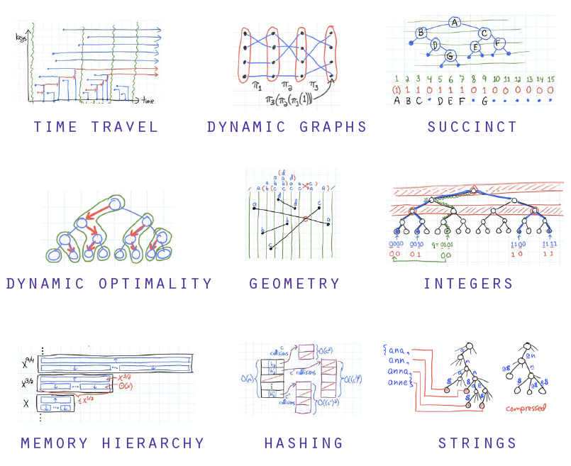

저는 알고리즘을 대체로 Java를 사용해서 풉니다.

앞으로 올릴 알고리즘이나 자료구조에 대한 게시물들도 Java 코드로 많이 표현될 테고요.

근데 문득, 그런 생각이 들었습니다. 우리는 왜 자료구조와 알고리즘을 공부해야 할까??

물론 당장 공부할 내용이 없을 경우에는 틈틈이 알고리즘이나 자료구조를 공부하는 것이 좋습니다.

하지만 당장 공부할 게 없을리는 없구요...! (세상엔 공부할 게 넘치니까요!!)

그럼 굳이 시간을 내서 공부할 필요가 없지 않을까요??

그냥 알고리즘 테스트만 통과할 정도만 되면 되는 것 같은데...

그렇게 생각하시는 분들에게 도움이 됬으면 좋겠습니다.

> 주의, 이 글은 취업 준비생(본인) 기준에서의 글입니다.   
  극단적인 신뢰는 추천드리지 않습니다! 이에 대한 내용들은 의견이 분분하기 때문입니다.  

 

  

## 저는 알고리즘 대회를 나갈 생각이 전혀 없습니다. 
--- 

알고리즘이나 자료구조에 시간을 투자할 바에는, 

제 아이디어를 구현하면서 **여러 기술들을 접하는 게 더 좋다고** 생각합니다.

인턴 경험 6개월 동안 더더욱 느꼈습니다. API 개발팀으로 있었지만, 

*알고리즘이라고는 하나도 사용하지 않았고, 필요성도 느끼지 못했습니다.*

단순하게 배열을 쭉 풀어서 값을 바꿔주고, 꺼내주는 수준이었죠.

사실 알고리즘이나 자료구조를 파면서 코드를 짜보거나 문제를 푸는 일에 시간을 투자할 바에

제 개인적인 프로젝트를 완성하기 위해 새로운 언어나, 프레임워크들을 공부하는 게

더 나아보이기도 합니다.

제가 사용할 수 있는 기술들이 늘면 늘수록, 많은 것이 보였거든요.

  

## 굳이 공부해야 하나...
--- 

이미 세상엔 저보다 똑똑한 사람들이 수두룩 합니다.

그 분들이 만들어 놓은 자료들을 사용하기만 하면 됩니다.

때에 따라서 효율적인 알고리즘들은 이미 구현이 되어있고,

Java의 경우에는 Collection이라는 API 안에 대다수의 자료구조들이 만들어져 있기 때문이죠.

구글링만 잘 한다면, 제때 필요한 자료들을 금방 구해서 쉽게 입힐 수 있습니다.

점점 공부해야 할 필요성을 느끼지 못하고 있어지죠..

  

## 그럼에도 공부해야 한다고 생각하는 이유는?
---

### 현실적으로는

현실적으로 말하자면, 코딩테스트에서는 제한된 시간 내에 **정확성** 뿐만 아니라 **효율성**도 많이 봅니다.

단순하게 ArrayList를 쓰느냐 LinkedList를 쓰느냐에 따라 결과물이 차이가 많이 날 수 있다는 것이죠.

순발력의 차이가 나기 시작합니다. 

본인이 주로 사용하는 언어(저의 경우는 Java)에 구현되어 있는 자료구조나, 구현해야 하는 자료구조가,

빨리 머리속에서 나오지 않는다면 그만큼 검색해서 가져오는 데, 오래 걸리겠죠??

또, 어떤 **탐색법**을 사용해야 하는 지, 어떤 **정렬방법**을 써야하는 지도 마찬가지 입니다.

딱 봤을때, 어떤 방법을 사용해서 어떤 식으로 짤 지 생각이 난다면 

두, 세 배 빨리 짤 수 있을 것이고, 그만큼 더 여유가 생기는 것 같습니다.

 

 

### 이상적으로는

제가 개인적인 생각은 이렇습니다.

알고리즘은 사실 ***나름의 코딩 스킬***이라고 생각합니다.

단순하게 알고리즘 문제를 푼다고 해서 알고리즘으로 단정짓기 보다는

코딩을 할 때 나를 더 즐겁게 해줄 수 있는 도구라고 생각합니다.

단순히 코드를 짤 때, 기계처럼 있는 것들을 가져다 사용하기 보다는 

*커스터마이징*해서 사용할 수 있으며, *본인만의 코드*를 만들어 낼 수도 있습니다.

그런 과정들이 제 머리를 더 말랑하게 만들어 주었고,

다른 사람들이 짠 코드들을 볼 때 이해도가 더 높아질 수 있었습니다.

또, 어떤 라이브러리나, 프레임워크를 쓰더라도 내부의 함수들을 훑어보면서

내가 필요한 것들만 뽑아 쓸 수 있는 능력이 생길 수 있었습니다.

  

## 하지만...
---

극단적인 효율충이 된다면...

다른 사람은 물론, 본인도 본인이 짠 코드를 다시 분석하게 되는 상황이 생길 수도 있습니다.

인턴 마지막 쯤에 그런 경험이 있었습니다.

분명 잘 돌아가는데 남들도 리뷰가 안되고, 저도 어떻게 짰는지 모르겠는 그런 코드였습니다.

또, 굳이 바꿀 필요 없는 코드를 효율적을 수정하겠다고, 

하루 종일 머리를 싸맸다가 시간만 낭비한 적도 있었습니다.

안정성과 효율성은 다르기 때문에 그런 상황들은 최대한 피하는 게 좋습니다.

  

## 정리하며
---

자료구조나 알고리즘을 공부하면서 저는 이론으로 외우려고 하지 않습니다.

당연히 외워야 하는 것들도 많지만, 쓰다보면 익혀지는 것을 추구합니다.

문제를 보고 생각난 아이디어대로 짜서 되면 뿌듯해하고, 안된다면 다른 방법을 생각하는 겁니다.

알고리즘을 단순하게 암기과목으로 받아들이지 않고,

창의력을 요하는 퀴즈라고 생각하고 푼다면 좀 더 즐거운 마음으로 짤 수 있지 않을까라는 마음입니다.

저는 알고리즘, 자료구조의 마스터가 될 필요는 없다고 생각합니다.

하지만 공부해야할 필요성은 충분히 있다는 것이 제 의견입니다.

오늘도 즐겁게 코딩하시기를 바라겠습니다.