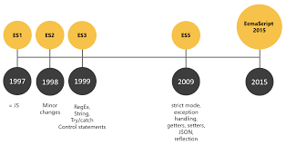

JavaScript는 ECMAScript를 토대삼아 만들어진 언어입니다.

ECMAScript는 1997년 6월, ES1 이라는 이름을 달고 태어나 2009년 12월에 ES5 까지 자리를 잡았었습니다.



현재 2019. 12. 17 기준으로 ESMAScript 2020 이 출시가 되었습니다.

그럼 ES5 부터 ES2020 까지의 주요 특징들을 확인해보겠습니다.

<br></br>

### ES5 (2009)

---

주요 변화

- "use strict"
- Array 에 대한 forEach, map, filter, reduce, some, every 함수 지원
- Object 에 대한 getter / setter 지원
- JSON 지원

### "use strict"

JavaScript 를 사용할 때에 strict 하게 오류를 잡아주는 방식입니다.

이는 자유로운 JavaScript에서 *안전한  *작성을 도와주는 역할을 합니다.

> 이 전의 JavaScript에서는 선언 없이 변수명과 값을 입력하는 방식도 통용하였습니다.  
> 하지만 이 방법은 아무리 블록 안에 있다고 하더라도 전역 변수로서 역할을 수행하게 됩니다.  
> 이럴 시에 생길 수 있는 치명적인 오류를 방지하기 위해 생겨난 문구입니다.

<br></br>

### ES6 (ES 2015)

---

주요 변화

- let, const 키워드
- arrow function
- Classes
- 매개변수 초기값 설정
- Array 에 대한 find, findIndex 함수 지원
- Array Rest / Spread Elements
- import, export 지원

### let, const

var 는 함수 scope를 가지고 있었습니다.

이에 따라 *block 단위의 scope*를 필요로 하여 **let** 이 만들어졌고 *상수형 키워드*를 위해 **const** 를 만들었습니다.

### arrow function

화살표 함수는 두 가지 특징을 가집니다.

1.  익숙해지면 **편하고** **간결한 코드**를 작성할 수 있습니다.
2.  **this**를 바인딩 하지 않습니다

```JavaScript
const fnTest = {
  name: 'function test',

  normal_arrow_fn: function() {
    console.log(this.name, '1');

    ['2', '3'].forEach(value => {
      console.log(this.name, value);
    });

    ['4', '5'].forEach(function(value) {
      console.log(this.name, value);
    });
  },

  arrow_normal_fn: () => {
    console.log(this.name, '6');

    ['7', '8'].forEach(function(value) {
      console.log(this.name, value);
    });

    ['9', '10'].forEach(value => {
      console.log(this.name, value);
    });
  },
};

// function test 1, function test 2, function test 3, undefined 4, undefined 5
fnTest.normal_arrow_fn();

// undefined 6, undefined 7, undefined 8, undefined 9, undefined 10
fnTest.arrow_normal_fn();
```

화살표 함수는 *항상 상위 scope의 this*를 호출합니다. 반대로 일반 함수는 *현재 scope의 this*를 호출합니다.

normal_arrow_fn에서 사용된 일반 함수에서 this는 객체, 즉 fnTest 자신을 가리키는 this를 의미합니다.

따라서 2, 3은 *화살표 함수*가 사용되어 해당 함수의 상위 scope 인 **fnTest**를 불러올 수 있었습니다.

반대로 4, 5는 *일반 함수*가 사용되어 **normal_arrow_fn라는 함수**를 가리키며, 객체가 아니기 때문에 undefined가 출력됩니다.

arrow_normal_fn에서 사용된 화살표 함수에서 this는 global을 가리킵니다. 이 때, 웹에서 쓰일 경우 window를 가리킵니다.

따라서 7, 8은 일반 함수가 사용되어 **arrow_normal_fn라는 함수**를 가리키고, 객체가 아니기 때문에 undefined가 출력됩니다.

마지막으로 9, 10은 상위 scope인 this 바로 global을 호출하기 때문에 undefined가 출력됩니다.

> 따라서 위의 예시처럼 객체로서 이용하고 싶다면, 내부에서 함수를 선언할 시 **화살표 함수를 사용하지 않는 것이 좋습니다.**

### 매개변수 초기값 설정

함수의 매개변수가 입력되지 않았을 시 초기 매개변수를 입력 가능합니다.

이는 **매개변수를** **선택적으로 사용 가능** 하다는 의미입니다.

```JavaScript
const add = (x, y = 10) => {
  return x + y;
};

console.log(add(5));        // 15
console.log(add(5, 10));    // 15
```

### import, export 지원

특정 모듈또는 함수, 변수들을 다른 파일에서 불러올 때는 request, 내보내기 위해서 exports 를 사용했었습니다.

하지만 낭비되는 메모리를 방지하기 위해 선택적으로 불러올 수 있는 import 기능이 추가되었습니다.

```JavaScript
// require, exports

// cicle.js
var PI = Math.PI;

exports.area = function(r) {
  return PI * r * r;
};

exports.circumference = function(r) {
  return 2 * PI * r;
};

// foo.js
var circle = require('./circle.js');
console.log('The area of a circle of radius 4 is ' + circle.area(4));
```

```JavaScript
// import, export

// cicle.js
var PI = Math.PI;

export const area = function(r) {
  return PI * r * r;
};

export const circumference = function(r) {
  return 2 * PI * r;
};

// foo.js
import * as circle from './circle.js'
console.log('The area of a circle of radius 4 is ' + circle.area(4));

// foo.optimization.js
import { area } from './circle.js'
console.log('The area of a circle of radius 4 is ' + area(4));
```

<br></br>

### ES7 (ES 2016)

---

주요 변화

- 제곱 연산자 지원( ' \*\* ' )
- Array 에 대한 includes 함수 지원
- Decorator

Decorator

Decorator는 선언된 클래스와 그 property들의 성질과 특성을 정해주어 디자인 시각으로 보여주는 방법입니다.

이 방법을 활용하여 클래스와 property들의 성질을 부여하여 안정성을 높여줍니다.

```JavaScript
function readonly(target, property, descriptor) {
  descriptor.writable = false;
  return descriptor;
}

class Book {
  @readonly
  author = 'Raccoon';
}

const book = new Book()  ;
myCar.author = ‘Raccoon ver 2’;  // 오류
```

<br></br>

### ES8 (ES 2017)

---

주요 변화

- Object 에 대한 entries, values, getOwnPropertyDescriptors 함수 지원
- String 에 대한 padStart, padEnd 함수 지원
- Trailing commas in function
- Async / Await

### Object 에 대한 함수

object 에 대한 함수들을 코드로 정리해보겠습니다.

```JavaScript
const obj = {
  name: 'Raccoon',
  country: 'Korea',
};

console.log(Object.keys(obj));
// [ 'name', 'country' ]

console.log(Object.values(obj));
// [ 'Raccoon', 'Korea' ]

console.log(Object.entries(obj));
// [
//     [ 'name', 'Raccoon' ],
//     [ 'country', 'Korea' ]
// ]

console.log(Object.getOwnPropertyDescriptors(obj));
// {
//     name: {
//         value: 'Raccoon',
//         writable: true,
//         enumerable: true,
//         configurable: true
//     },
//     country: {
//         value: 'Korea',
//         writable: true,
//         enumerable: true,
//         configurable: true
//     }
// }
```

### Trailing commas in function

함수의 인자나 매개변수 마지막에 **콤마를 선택적으로 붙일 수 있다**는 것입니다.

대개 ESLint 같은 lint 도구들은 이런 방식을 *선호하며 장려*합니다.

이러한 이유는 이 후, 다른 인자나 객체 등이 들어올 때 _형상관리 도구(Git)_ 에서 변화를 **순수하게 추가된 부분만 확인**하기 때문입니다.

### Async / Await

Async 와 Await 함수는 *비동기 처리에 대한 이해*가 기본적으로 존재해야 합니다.

> 비동기와 동기, 그리고 콜백 함수에 관한 포스팅은 이 후, 준비해볼 예정입니다.

Async 함수 선언은 AsyncFunction 객체를 반환하는 비동기 함수로 정의됩니다.

지금까지 비동기 함수는 Promise를 사용하여 그 결과를 반환했었습니다.

Promise로 선언된 함수에 대한 구조를 then / catch로 반환하지 않고, *예외처리 없이 동기적인 환경*을 제공합니다.

```JavaScript
function resolveAfter2Seconds() {
  return new Promise(resolve => {
    setTimeout(() => {
      resolve('resolved');
    }, 2000);
  });
}

async function asyncCall() {
  console.log('calling');
  var result = await resolveAfter2Seconds();
  console.log(result); // resolved
}

function normalCall() {
  console.log('calling');
  var result = resolveAfter2Seconds()
    .then(result => result)
    .catch(err => {
      throw new Error(err);
    });
  console.log(result); // resolved
}

asyncCall();
normalCall();
```

<br></br>

### ES9 (ES 2018)

---

주요변화

- Rest 매개변수 / 산개 구문
- 정규식 강화
- Promise finally

### Rest 매개변수, 산개 구분

지금까지 여러 개의 값으로 이루어진 Array나, Object 등을 *통째로 받아서 다시 가공하는 과정*을 거쳐서 사용했었습니다.

하지만 이와 같은 방법을 사용하면 더 직관적이면서, 더 편하게 사용할 수 있게 됩니다.

```JavaScript
function sum(...theArgs) {
  return theArgs.reduce((previous, current) => previous + current);
}

console.log(sum(1, 2, 3));        // 6
console.log(sum(1, 2, 3, 4));     // 10


const { a, b, c } = {
  a: 1,
  b: 2,
  c: 3,
};

console.log(a, b, c);    // 1, 2, 3


const d = 4;
const e = 5;
const f = 6;
const g = { h: 7, i: 8, j: 9 };

const obj = { d, e, f, ...g, h: 10000 };

console.log(obj);       // { d: 4, e: 5, f: 6, h: 10000, i: 8, j: 9 }

```

### Promise finally

finally 함수는 Promise 객체를 반환합니다. Promise가 처리된 이후, 충족되거나 거부되거나 그 여부와는 관계없이 콜백 함수가 실행됩니다.

즉, Promise가 resolve로 들어오든, reject로 들어오든 관계없이 마지막으로 무조건 한 번은 실행되는 함수입니다.

```JavaScript
function resolveAfter2Seconds() {
  return new Promise(resolve => {
    setTimeout(() => {
      resolve('resolved');
    }, 2000);
  });
}
function rejectAfter2Seconds() {
  return new Promise((resolve, reject) => {
    setTimeout(() => {
      reject('rejected');
    }, 2000);
  });
}

function resolveCall() {
  resolveAfter2Seconds()
    .then(result => console.log(result))
    .catch()
    .finally(() => {
      console.log('Resolve Finally');
    });
}

function rejectCall() {
  rejectAfter2Seconds()
    .then()
    .catch(error => console.log(error))
    .finally(() => console.log('Reject Finally'));
}

resolveCall();  // resolved, Resolve Finally
rejectCall();   // rejected, Reject Finally

```

<br></br>

### ES10 (ES 2019)

---

주요변화

- Object에 대한 fromEntries 함수 추가
- Array에 대한 flat, flatMap 함수 추가
- String에 대한 trimStart, trimEnd, trimLeft, trimRight 함수 추가

Object에 대한 fromEntries 함수 추가

Object.entries 함수의 반대 역할로 Array를 Object로 만들어줍니다.

```JavaScript
const arr = [
  ['name', 'Raccoon'],
  ['country', 'Korea'],
];

console.log(Object.fromEntries(arr));
// {
//     name: 'Raccoon',
//     country: 'Korea'
// }

```

Array에 대한 flat, flatMap 함수 추가

기존에 lodash라는 모듈에서 파생된 함수로 배열에서 사용하지 않는 껍데기를 제거해 주는 역할을 합니다.

```JavaScript
const arr = [10, [20, [30]]];

console.log(arr.flat());    // => [10, 20, [30]]
console.log(arr.flat(1));   // => [10, 20, [30]]
console.log(arr.flat(2));   // => [10, 20, 30]

const arr = [4.25, 19.99, 25.5];

console.log(arr.map(value => [Math.round(value)]));     // => [[4], [20], [26]]
console.log(arr.flatMap(value => [Math.round(value)])); // => [4, 20, 26]

```

<br></br>

###  ES 2020

---

주요변화

- Class 내에 private field
- Optional Chaining Operator
- Nullish Coalescing Operator
- BigInt

### Class 내에 private field

지금까지 Class 내 변수들은 외부에서 해당 class에 대한 *객체를 통해 접근 가능*했습니다.

해당 방법을 통해 값을 **직접 변경**하면서 치명적인 결함을 초래할 수 있었고, 이를 보완하기 위해 만들어졌습니다.

```JavaScript
class Test {
  #privateVar = 1;
  publicVar = 2;

  getPrivate() {
    return this.privateVar;
  }

  add() {
    this.privateVar++;
    this.publicVar++;
  }
}

const test = new Test();
console.log(test.privateVar);   // Uncaught SyntaxError: Private field '#privateVar'
console.log(test.publicVar);    // 2
test.add();
console.log(test.getPrivate()); // 2
console.log(test.publicVar);    // 3

```

### Optional Chaining Operator & Nullish Coalescing Operator

지금까지는 Object의 깊이가 깊을 때에 이 인자가 *값이 있는지를 확인*하기 위해서는 *한 번씩 확인하는 과정*을 거쳤었습니다.

이 번거로운 과정들을 간단하게 줄이기 위한 방법으로 **Optional Chaining Operator**가 추가가 되었습니다.

또한 지금까지는 특정 값을 비교하기 위해서는 || 이나 !! 방법들을 활용했습니다.

하지만 이 방법들은 만약 number의 타입을 받을 때 *실제로 값이 0*이 들어오고 이것이 *유효한 값*이라고 하더라도 수정되었었습니다.

이를 방지하기 위한 방법으로 고안 된 것이 **Nullish Coalescing Operator** 입니다.

```JavaScript
const obj = {
  name: 'Raccoon',
  friends: undefined,
  family: {
    parents: {},
    brothers: {
      younger: {
        name: 'Raccoon ver 2',
      },
    },
  },
  girlFriend: '',
};

obj &&
  obj.family &&
  obj.family.brothers &&
  obj.family.brothers.younger &&
  obj.family.brothers.younger.name &&
  console.log(obj.family.brothers.younger.name);    // Raccoon ver 2

console.log(obj?.family?.brothers?.younger?.name);  // Raccoon ver 2

console.log(obj.girlFriend || undefined);       // undefined
console.log(obj.girlFriend ?? undefined);       // ''

```

지금까지 ES5 부터 ES2020까지 살펴보면서 중요하게 바뀌었던 부분들에 대해 알아보았습니다.

최근에 추가되는 기능들은 다양한 프로그래밍 방법(e.g. 함수형)들을 편하게 도와주는 역할을 해주는 것들이 눈에 띄게 늘기 시작했습니다.

하지만, 현재 nodejs에서 지원하는 기능들은 한정적이기 때문에 babel을 활용하여 컴파일이 가능합니다.

브라우저 콘솔에서 사용하는 것도 브라우저의 엔진이 업데이트 된 이후에야 사용 가능합니다.

작성일 기준 Chrome의 V8 엔진은 ES10(ES 2019) 까지만 지원 가능합니다.

<br></br>

### 정리하는 글

---

JavaScript 는 단순히 HTML, CSS를 활용하여 페이지를 개발할 때 window의 역할(e.g. alert)을 해주는 역할뿐만이 아니라

대형 프로젝트에서도 충분히 쓰일 수 있는 언어이며,

JavaScript를 기반으로 다양한 프레임워크들이 파생되어 다양한 경험을 하기에 적합한 언어로 느껴집니다.

업데이트 되면서 생기는 함수들, 기능들에 대해 개방적인 것이 곧 새로운 것에 열린 자세가 될 수 있으며,

원래 있던 것을 쓰면 되지라는 생각보다는 새로운 것을 시도해보고 적용해보는 시도들이 앞으로 또 다른 것들을 배울 때에 밑거름이 되어

큰 도움이 될 수 있을 것이라고 생각합니다.

참고

[https://www.w3schools.com/js/default.asp](https://www.w3schools.com/js/default.asp)

[https://developer.mozilla.org/](https://developer.mozilla.org/)
