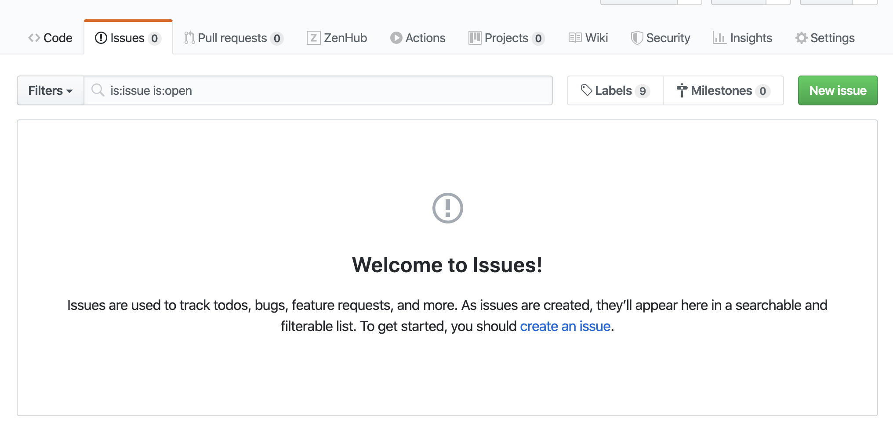
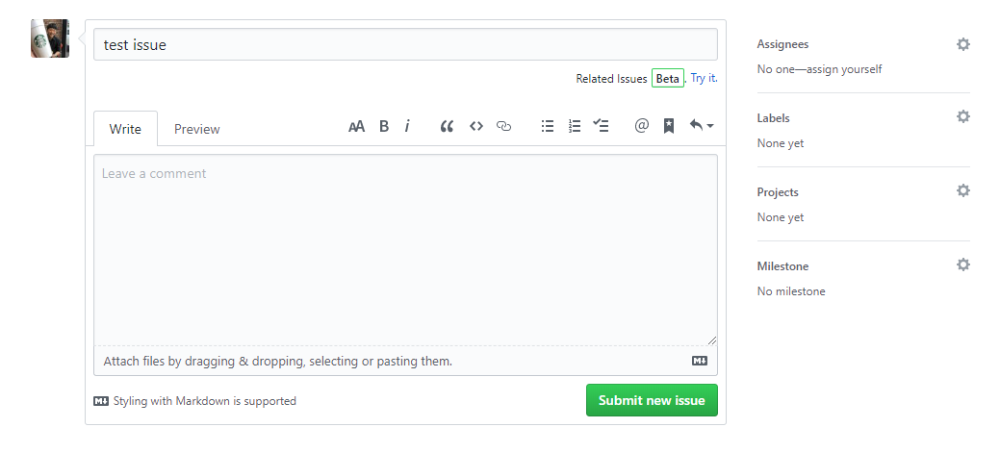
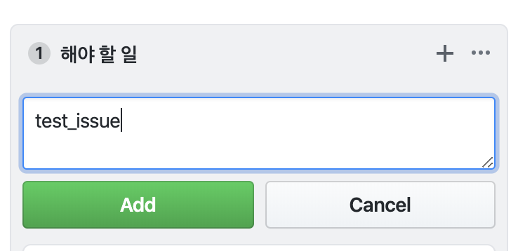
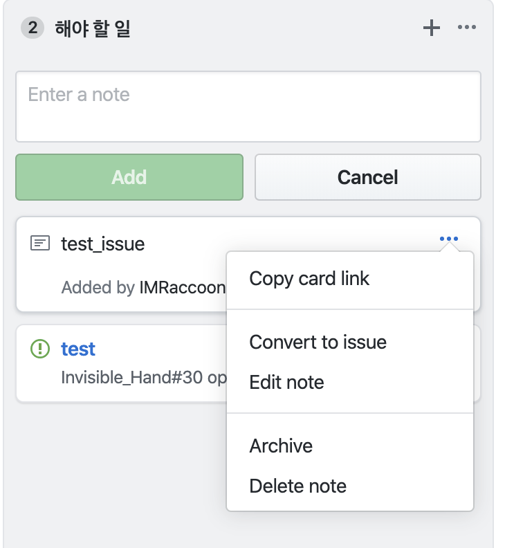

GitHub에는 여러 가지 기능이 존재합니다.

혼자서 특정 프로젝트를 진행하거나 공부할 때에는 사용할 일이 없습니다.

하지만 프로젝트를 여러 명과 동시에 진행할 때에 유용하게 쓸 수 있는 **GitHub Project** 라는 기능을 소개하려고 합니다.

그 전에 **Git Issue**에 대한 설명,

그리고, issue를 사용하여 project를 관리하는 방법을 보도록 하겠습니다.

  

## GitHub Issue

---

Issue, 말 그대로 _문제_ 라는 사전적의미를 지닌, 하나의 노트라고 생각하면 됩니다.

일반적으로 Issue를 오픈소스에서 사용할 때에는 **사용자들의 건의사항** 또는, **오류내용**을 올립니다.

그 오픈소스를 개발하고 관리하는 사람들은 개발해야 할 내용, 개선, 일정, 문제 등 **개발에 있어 필요한 내용**을 올립니다.

이 Issue를 사용할 때에는 대체적으로 규모가 큰 프로젝트의 경우 Issue의 셩격에 따라 형식(이하, 템플릿)을 만들어 사용하기도 합니다.

하지만, 작은 규모의 프로젝트에서는 굳이 형식을 중요시 하지 않고 기능만을 충실하게 사용하기도 합니다.

  

### issue를 생성해보겠습니다.

issue는 Repository 별로 생성합니다. 해당 issue에 속하는 Repository에 들어가 생성합니다.

상위에 존재하는 **New issue** 버튼을 누릅니다.

다양한 것들을 채울 수 있습니다. 하나씩 살펴보면서 설명하겠습니다.

- Title: Issue의 이름을 입력합니다.

- Write: Issue의 내용을 입력합니다.

  - Git은 기본적으로 Markdown 문법을 따라갑니다.
  - 다양한 기능을 포함하고 싶다면 Markdown 문법을 확인하시길 바랍니다.
  - 유용한 기능으로 체크 박스, 넘버링, 또는 다른 issue를 태그 할 수 있습니다.
  - 이 때, Preview를 통해 쓴 내용을 볼 수 있습니다.

- Assignees: issue를 확인하거나, 해결해야 하는 사람, 책임자를 뜻합니다.

- Labels: issue의 주 성격을 보여줍니다.

  - 오류, 논의, 개발 등 대표 성향을 보여줍니다.
  - 두 개 이상 책정 할 수 있습니다.

- Projects: issue가 들어갈 Project를 의미합니다.

  > 이 후에 설명하도록 하겠습니다.

- MileStone: issue가 들어갈 MileStone을 의미합니다.
  - 이정표라는 뜻을 가지고 있습니다.
  - issue가 Deadline을 가졌을 때, MileStone과 함께 운용할 수 있습니다.

내용을 모두 채운 이 후에 **Submit new issue** 를 누르면 완성됩니다.

여기까지 왔다면, issue를 만드는 법을 알게 된 겁니다.

그럼 이제 GitHub Project를 알아보겠습니다.

  

## GitHub Project

---

GitHub Project 는 프로젝트가 진행될 때에, 관련 issue들과 Pull Request를 한 눈에 볼 수 있도록 도와줍니다.

이를 통해, 현재 프로젝트가 어느 단계에서 어떤 문제가 있는지 확인할 수 있습니다.

GitHub Project의 사용법은 Trello와 비슷합니다.

기본적으로 **To do**, **In progress**, **Done** 라는 세개의 열로 존재합니다.

프로젝트 성향에 따라 이름은 바꾸거나 추가가 가능하며, 구체적인 내용도 수정 가능합니다.

처음에 Issue를 생성하면 To do 열로 포함이 됩니다.

그리고 상황에 따라 issue를 드래그 하여 옮길 수 있습니다.

Project 내에서도 간단하게 note를 만든 뒤, issue를 만들 수 있습니다.

**Convert to issue** 를 통해 issue로 만든 뒤, 내용을 채울 수 있습니다.

또한 **Delete note** 를 통해 만들었던 note를 제거 할 수 있습니다.

  

## 정리하며

---

간단하게 Issue를 생성하고 Project라는 도구를 활용하는 방법을 확인해봤습니다.

2, 3명 정도의 인원이 프로젝트를 할 때에는 branch만 관리 잘하면 되었겠지만,

사람이 늘어날수록 프로젝트에 관련된 관리가 필요한 시점이 옵니다.

동시다발적으로 개발이 진행될 때에, 진행 내용 또는 문제점들을 한 눈에 확인하면서 진행한다면

조금 더 효율적이고 빠른, 그리고 안전한 개발이 될 수 있을 것이라고 생각합니다.
