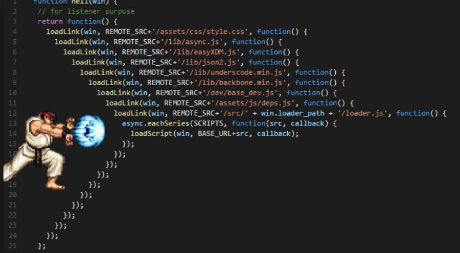

JavaScript에서는 비동기를 처리하는 것이 아주 중요합니다.

비동기라는 개념이 중요한 만큼 이를 처리하는 것도 중요할테죠.

그럼 이 비동기 함수를 처리하는 방법에 대해 알아봅시다.

<br>

## Callback Function

비동기에서 콜백 함수라는 말을 많이 들어보았을 껍니다.

도대체 콜백함수가 뭐냐, 다른 함수의 작업이 끝난 후 실행되는 함수를 말합니다.

함수는 JavaScript에서 객체이기 때문에 함수를 인자로 사용하거나 반환값으로 사용할 수 있습니다.

여기서 인자로 전해지는 모든 함수들을 콜백함수라고 합니다.

```JavaScript
function callWithMyName(callback) {
  callback('IMRaccoon');
}

function testFunction() {
  var hello = 'Hello';
  callWithMyName(function(name) {
    console.log(hello, name);
  });
}

testFunction();
```

위의 코드를 살펴보면 `testFunction` 함수에서 'Hello' 를 선언하고

`callWithMyName` 함수를 호출하며 인자로 함수를 익명함수를 넣어주었습니다.

그리고 `callWithMyName` 함수에서는 해당 익명함수에 'IMRaccoon'을 인자로 넣어주었습니다.

```zsh
Hello IMRaccoon
```

그리고 실행하면 예상과 동일하게 출력됩니다.

자 그럼 이 방법을 비동기를 활용한 코드로 바꾸어 보겠습니다.

```JavaScript
function call1(name) {
    setTimeout(() => {
        console.log(name);
    }, 1000)
}

call1('IMRaccoon');
console.log('End ?');
```

어디를 검색해도 볼 수 있는 내장 함수인 `setTimeout` 함수입니다.

살펴보자면, `call1` 함수에 'IMRaccoon'이 들어갑니다.

그리고 `setTimeout` 함수에 콜백함수를 넣어줍니다.

이렇게 할 시에 `setTimeout` 함수는 해당 시간이 지난 후에 콜백 함수를 호출하게 됩니다.

그럼 예상되는 출력은 다음과 같습니다.

```zsh
End ?
IMRaccoon
```

콜백함수를 어떤 식으로 활용하는 지 알꺼라고 생각합니다.

비동기 함수에서는 단순히 Trigger로서의 역할을 수행하는 것이 콜백함수 입니다.

<br>

### 콜백함수의 한계 (콜백 지옥)



콜백에 익숙해지다보면 다음과 같이 코딩을 하게 되기도 합니다.

실제로 이렇게 사용할 수 밖에 없는 코드들도 있기 때문입니다.

이런 식으로 콜백을 활용할 시에 문제점은 가독성입니다.

일반적으로 코드가 오른쪽으로 몰리면 몰릴수록 좋지 않은 코드라고 생각합니다.

`{}` 중괄호가 많을수록 가독성이 떨어지기 때문이죠.

콜백함수 내에서 이를 해결하는 방법은 익명함수를 사용하지 않고 이름을 부여하면 됩니다.

```JavaScript
function call() {
  setTimeout(() => {
    console.log('call 1');
    setTimeout(() => {
      console.log('call 2');
      setTimeout(() => {
        console.log('call 3');
        setTimeout(() => {
          console.log('call 4');
        }, 1000);
      }, 1000);
    }, 1000);
  }, 1000);
}

call();
```

위와 같은 방법을 아래와 같이 해결 할 수 있습니다.

```JavaScript
function call1() {
  setTimeout(() => {
    console.log('call 1');
    call2();
  }, 1000);
}

function call2() {
  setTimeout(() => {
    console.log('call 2');
    call3();
  }, 1000);
}

function call3() {
  setTimeout(() => {
    console.log('call 3');
    call4();
  }, 1000);
}

function call4() {
  setTimeout(() => {
    console.log('call 4');
  }, 1000);
}

call1();
```

그와는 별개로 또 다른 방법이 존재합니다. 바로 `Promise` 입니다.

<br></br>

## Promise

일단 Promise를 사용하려면 세 가지 조건을 알고 있어야합니다.

1. Pending: 대기, 비동기 로직이 아직 처리되지 않은 상태
2. Fulfilled: 이행 또는 완료, 비동기 처리가 모두 완료되어 결과값을 반환하기 전 상태
3. Rejected: 실패, 비동기 처리가 실패하거나 오류가 생긴 상태

기본적으로 `new Promise()` 를 선언한 경우,

콜백 함수의 인자로 `resolve` 와 `reject` 에 접근할 수 있습니다.

```JavaScript
new Promise(function (resolve, reject) {
  resolve();
});
// Fulfilled

new Promise(function (resolve, reject) {
  reject();
});
// Rejected
```

그리고 `resolve` 함수의 인자값은 `then` 으로

`reject` 함수의 인자값은 `catch` 으로 넘어가게 됩니다.

말로하면 모르겠으니, 코드를 봅시다.

```JavaScript
function checkMyName(name) {
  return new Promise(function(resolve, reject) {
    if (name === 'IMRaccoon') {
      resolve("Yes, It's your name");
    } else {
      reject("No, That's not your name");
    }
  });
}

function printName(targetName) {
  checkMyName(targetName)
    .then(resolved => console.log(resolved, targetName))
    .catch(rejected => console.log(rejected, targetName));
}

printName('IMRaccoon');
printName('IMPanda');
```

자 코드로 살펴보면 일단 `printName` 함수에 이름이 들어갑니다.

해당 함수에서는 `chechMyName` 으로 이름을 보내주고

`resolve` 되면 then에서, `reject` 되면 catch에서 처리를 해줍니다.

`checkMyName` 함수는 이름이 맞을 경우 "Yes, It's your name" resolve의 인자로

아닐 경우 "No, That's not your name" 를 reject의 인자로 보내어 실행합니다.

사실 Promise가 필요없는 기능이지만, 실제 비동기에서 활용할 때에도 해당 방식과 동일하게 됩니다.


시간이 걸리는 동작을 할 시에 Promise로 감싼 뒤, resolve, reject를 수행할 수 있고,

여러 모듈들이 이미 Promise로 감싸져 있기 때문에 이 함수 뒤에

then, catch를 붙여서 사용하는 경우가 많습니다.

그럼 여기서 여러 개의 Promise를 연결하는 법을 봅시다.

<br>

### then으로 연결하기

아까 콜백함수의 지옥처럼 Promise도 지옥을 만들 수 있습니다.

```JavaScript
function addOne(num) {
  return new Promise(resolve => resolve(num + 1));
}

function addTen(num) {
  return new Promise(resolve => resolve(num + 10));
}

function addHundred(num) {
  return new Promise(resolve => resolve(num + 100));
}

addOne(3).then(res1 => {
  addTen(res1).then(res2 => {
    addHundred(res2).then(res3 => console.log(res3));
  });
});
```

아까 분명 콜백지옥을 해결하자고 도입한게 Promise를 도입했는데

똑같은 코드, 오히려 함수에 이름이 있는데도 이런 모습을 가질 수 있습니다.

하지만 해결책은 훨씬 간단합니다.

```JavaScript
addOne(3)
  .then(res1 => {
    return addTen(res1);
  })
  .then(res2 => {
    return addHundred(res2);
  })
  .then(res3 => {
    console.log(res3);
  });
```

이런 식으로 내부에서 함수를 반환하면 해결됩니다.

근데 만약 중간에 `reject` 함수가 사용된다면?!

똑똑하게도 알아서 넘어갑니다.

```JavaScript
function addOne(num) {
  return new Promise((resolve, reject) => reject(num));
}

function addTen(num) {
  return new Promise(resolve => resolve(num + 10));
}

function addHundred(num) {
  return new Promise(resolve => resolve(num + 100));
}

addOne(4)
  .then(res1 => {
    return addTen(res1);
  })
  .catch(err => {
    return console.log(err);
  })
  .then(res2 => {
    return addHundred(res2);
  })
  .then(res3 => {
    console.log(res3);
  });
```

위의 코드에서 `addOne` 함수는 reject를 수행합니다.

이럴 경우 두 번째에 있는 catch에서 잡힙니다. 하지만, 맨 밑에 있는

then에서는 NaN 가 출력되게 됩니다.

이럴 경우를 대비해 항상 맨마지막에는 catch를 한번 더 걸어주는 것이 좋습니다.

<br>

### 한번에 Promise 수행하기

인자를 넘겨주는 방식이 아닌 여러 Promise를 한 번에 사용해야 하는 경우입니다.

이럴 경우에는 `Promise.all` 함수를 사용합니다.

Promise.all 함수는 배열로 인자를 받으며 인자로 들어간 모든 객체들을 수행할 때까지 대기합니다.

> 꼭 Promise로 만들어진 함수가 아니어도 실행됩니다.

이 후, then 을 통한 결과값은 인자들의 값을 배열로 반환합니다.

```JavaScript
function addOne(num) {
  return new Promise(resolve => resolve(num + 1));
}

function addTen(num) {
  return new Promise(resolve => resolve(num + 10));
}

var can_i_join = -1;

Promise.all([addOne(1), addTen(10), can_i_join])
  .then(res => console.log(res))
  .catch(err => console.log('error : ' + err));

// [2, 20, -1]
```

여기서 `addOne` 함수가 `reject(num)` 를 반환할 때 결과값은 다음과 같습니다.

```zsh
error : 1
```

하나의 인자값이라도 reject되는 경우 다른 함수들의 성공여부과 관계없이 catch로 들어옵니다.

만약, 여러 개의 reject가 있을 경우 가장 먼저 수행되는 reject를 받습니다.

<br>

여기까지 Promise에 대한 것들을 배웠습니다.

하지만 당연하게도 이러한 then, catch보다 try, catch가 더 편하고, 직관적이기도 합니다.

그럼 try, catch문을 보러 가보도록 하겠습니다.

<br></br>

## Promise를 처리하는 또 다른 방법, Async/Await

분명 try, catch를 알려준다고 했는데 Async와 Await을 알려주게 되서

약간 미안하지만, 엄청 쉽기 때문에 빠르게 사용하는 법을 익혀보도록 합시다.

```JavaScript
function addOne(num) {
  return new Promise(resolve => resolve(num + 1));
}

function addTen(num) {
  return new Promise(resolve => resolve(num + 10));
}

function addHundred(num) {
  return new Promise(resolve => resolve(num + 100));
}

async function main() {
  var afterOne = await addOne(1);
  var afterTen = await addTen(10);
  var afterHundren = await addHundred(100);

  console.log(afterOne + afterTen + afterHundren);

  // 또는
  // console.log((await addOne(1)) + (await addTen(10)) + (await addHundred(100)))
}

main();
```

아까 보았던 함수들입니다.

코드를 잘 보면 function 앞에 `async`

그리고 호출하는 Promise 함수 앞에는 `await` 이 있습니다.

await를 사용하는 함수나 객체는 선언 전에 `async`라는 키워드를 사용하고

Promise 함수는 `await` 라는 키워드를 통해 대기합니다.

사실상 동기적인 처리라고 볼 수 있습니다.

then, catch 보다 직관적으로 함수의 흐름을 볼 수 있는 것이 장점입니다.

#### 그럼 여기서 try, catch는?

```JavaScript
function addOne(num) {
  return new Promise((resolve, reject) => reject(num));
}

function addTen(num) {
  return new Promise(resolve => resolve(num + 10));
}

async function main() {
  try {
    var afterOne = await addOne(1);
    var afterTen = await addTen(10);

    console.log(afterOne + afterTen);
  } catch (error) {
    console.log('error : ' + error);
  }
}

main();
// error : 1
```

감이오죠? reject되는 Promise가 try내에서 실행 될 때에는

catch로 들어가면서 나머지 코드들을 무시하게 됩니다.

일반적인 try, catch문과 동일하지만 reject함수를 `Exception` 과 동일하게 생각하면 됩니다.

<br></br>

## 정리하며

콜백함수, Promise, 그리고 async, await의 사용법에 대해 빠르게 알아보았습니다.

실제로 이 것들을 개발할 때, 사용한다면 당연히 또 어려움이 있을 것입니다.

하지만 개발 능력은 경험치와 비례하고 경험치는 시간에 비례합니다.

많은 시간을 투자하는 만큼 분명히 실력은 늘 것입니다.

그래도 알고 개발하느냐 모르고 개발하느냐에 따라 효율성은 천차만별이 될 껍니다.

핵심만 짚고 넘어갔지만, 더 깊게 알고 싶다면 다양하게 검색해보고, 다양하게 개발해봅시다.
