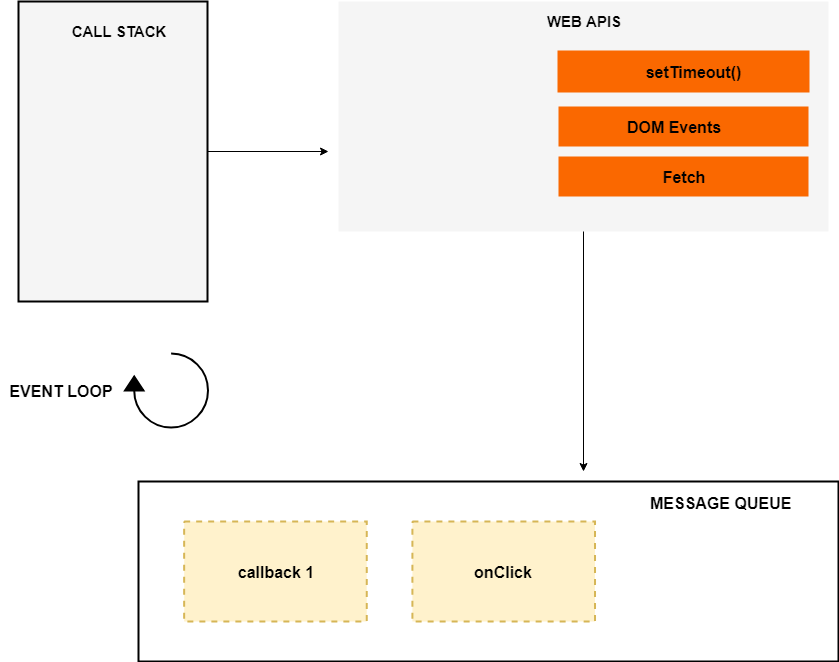

비동기는 JavaScript 에서 빼놓을 수 없는 개념입니다.

그럼 비동기가 무엇이냐 한 번 살펴보겠습니다.

<br></br>

## JavaScript 에서의 비동기

JavaScript는 기본적으로 single-thread 언어입니다.

**하나의 thread에서 실행되는 언어**라는 뜻입니다.

이 말은 곧, JavaScript 엔진은 _한 번에 하나의 명령문을 실행_ 한다는 의미입니다.

single-thread 일 경우에 동시성 문제(ex. race-condition)들을 고려해 줄 필요가 없어 코드가 단순하지만,

네트워크 엑세스처럼 ~~상대적으로~~ 오래 걸리는 작업을 메인 스레드에서 수행할 수 없다는 의미기도 합니다.

만약 본인이 운영하는 웹 서버에서 API를 통해 데이터를 요청하는 일을 할 때, 요청을 처리하는데 시간이 오래 걸린다면

메인 스레드가 요청을 처리하여 다른 작업들을 하지 못할 것이고, 이 때문에 웹 페이지가 응답하지 않을 수 있습니다.

이 때에, 비동기라는 개념이 사용됩니다. **비 동기적으로 작업을 수행**한다는 의미입니다.

말로 하는 것보다는 코드로 보는 것이 훨씬 더 좋을 것이라고 생각됩니다.

---

일단 동기식 JavaScript를 살펴보겠습니다.

```JavaScript
const second = () => {
  console.log('잘 지냈나요?');
};

const first = () => {
  console.log('안녕하세요!');
  second();
  console.log('잘가요~');
};

first();
```

일반적인 코드로 모두가 예상할 수 있듯이 아래의 순서대로 출력됩니다.

```zsh
안녕하세요!
잘 지냈나요?
잘가요~
```

그럼 이제 오래 걸리는 작업들을 수행하는 코드를 확인하겠습니다.

```JavaScript
const processImage = (image) => {
  /**
  * 이미지 작업에 대한 처리
  **/
  console.log('Image processed');
}

const networkRequest = (url) => {
  /**
  * 네트워크에 자원 요청
  **/
  return someData;
}

const greeting = () => {
  console.log('Hello World');
}

processImage(IMRaccoon.jpg);
networkRequest('www.imraccoon-developer.com');
greeting();
```

image가 엄청 크고 이를 처리하는 `processImage` 함수가 복잡하여 10초가 걸린다고 가정합시다.

그리고 www.imraccoon-developer.com 이라는 사이트에 트래픽이 어마무시해서 20초가 걸린다고 가정합시다.

이럴 경우에 동기적으로 작업이 수행된다면 `greeting` 함수까지 총 30초라는 시간이 걸립니다.

위의 함수들이 _수행되는 동안 다른 작업이 수행될 수 없기 때문_ 에 오래 걸리며, 이상적이지 않은 이유입니다.

<br>

## 그럼 어떻게 해결해야 될까?

여기서 비동기 콜백개념이 나옵니다.

일시적으로 코드를 수행하는 것을 막고 다음 작업을 수행하는 것입니다.

아래의 예시코드를 확인하겠습니다.

```JavaScript
const networkRequest = () => {
  setTimeout (() => {
    console.log ('Async Code');
  }, 2000);
  // 여기서 setTimeout 함수는 네트워크의 요청을 예시로 사용하기 위해서 사용한 함수입니다.
};

console.log('Hello World');

networkRequest();

console.log('Bye');
```

기본적으로 `setTimeout` 함수는 매개변수로 콜백함수를 내장하고 있습니다.

`setTimeout` 함수가 의미하는 것은 2초 뒤에 'Async Code'를 출력한다는 의미입니다.

그럼 실제로 실행했을 때는, 어떻게 출력되는 지 봅시다.

```zsh
Hello World
Bye
# 약 2초 뒤
# ...
Asycn Code
```

이렇게 출력되는 것이 비동기를 콜백함수로 처리하는 것입니다.

조금 더 low 레벨로 내려가서 JavaScript 엔진을 통해 알아봅시다.

<br>

### 한술 더 떠서 Javascript Engine Structure

---

> 넘어가도 되는 부분입니다. 궁금하지 않으면 보지 않아도 됩니다.

JavaScript Engine은 크게 세 개의 영역으로 나눌 수 있습니다.

1. **Call Stack**
2. **Heap**
3. **Event Queue (Task Queue)**

시스템 관련 수업이나, 운영체제를 공부했다면 기억이 날 법한 단어들입니다.

이 세가지 그리고 **Event Loop** 까지 어떻게 수행되는 지 알아봅시다.

### Call Stack

- 일반적인 시스템 내의 Stack의 역할(LIFO)과 동일합니다.
- 차례대로 명령어를 수행하면서 들어온 함수들을 차례로 수행하는 역할입니다.

### Heap

- 동적으로 만들어진 객체가 메모리에 할당되는 곳입니다.
- 쉽게 말하면 프로그램 수행 중에 만들어지는 객체가 메모리에 할당되는 것입니다.
- JavaScript 내에서 동적 할당된 객체를 자체 수거(garbage collection) 합니다.
- 하지만, 프로그램 수행 중에 동적 할당이 많을 경우, 자체적으로 할당을 풀어주는 것도 필요합니다.

### Event Queue

- JavaScript의 런타임 중에 처리해야 되는 일들을 임시 저장하는 곳입니다.
- 그리고 Stack이 비었을 때, 대기열 순서대로 작업을 수행합니다.(LILO)

#### Event Loop

- 이 때, Event Loop 에서는 Stack 과 Queue를 지켜보다가
- Stack이 비었을 때 Queue의 작업을 Stack에 밀어 넣습니다.



기본적으로 Call Back이 호출될 경우 Web API 에서 해당 함수를 수행합니다.

수행이 다 된 뒤에 Event Queue로 저장이 되고,

Stack이 빌 경우에 Event Loop가 Stack에 작업을 넣습니다.

코드로 살짝 예시를 보겠습니다.

```JavaScript
function call1() {
    setTimeout(() => console.log('call 1'), 0);
    call2();
}

function call2() {
    setTimeout(() => console.log('call 2'), 0);
    call3();
}

function call3() {
    console.log('call 3');
}

call1();
```

우리는 콜백을 배웠습니다. 결과값을 예상해보자면

`call1` 와 `call2` 함수는 둘 다 0ms을 대기하기 때문에 바로 실행될 것이라고 예상할 수 있습니다.

하지만 결과는

```zsh
call 3
call 1
call 2
```

이렇게 출력됩니다. Web API로 갔다가 바로 Event Queue에 들어가서

Stack 이 비어질 때까지 기다리는 것입니다.

자 그럼 이제 다시 본론으로 돌아가 봅시다.

<br></br>

## 비동기 처리에 대하여

콜백 함수 이외에도 비동기를 처리하는 방법에는 `Promise` 가 존재합니다.

ES6 이후부터 Job Queue / Micro-task Queue 라는 개념이 도입됩니다.

이는 콜백에서 쓰이는 Queue보다 더 높은 우선순위를 가지며,

Event Loop 에서 먼저 Stack으로 불러옵니다.

사용방법을 이해하고 있다는 가정하에 코드로 살펴보겠습니다.

```JavaScript
function call1() {
  setTimeout(() => console.log('call 1'), 0);
  call2();
}

function call2() {
  new Promise((resolve, reject) => resolve('call 2'))
    .then(response => console.log(response))
    .catch(error => {
      throw new Error(error);
    });
  call3();
}

function call3() {
  new Promise((resolve, reject) => resolve('call 3'))
    .then(response => console.log(response))
    .catch(error => {
      throw new Error(error);
    });
  call4();
}

function call4() {
  console.log('call 4');
}

call1();
```

0초만에 수행하는 `call1` 함수와 `call2`와 `call3` 함수는 단순 문자열 반환 후 출력합니다.

이랬을 시 수행되는 순서는 `Promise` 가 우선순위가 더 높기 때문에

```zsh
call 4
call 2
call 3
call 1
```

이와 같은 순서로 출력하게 됩니다.

그럼 Promise가 resolve된 이후 실행되는 코드에서는 순서가 어떻게 될까요?

```JavaScript
function call1() {
  setTimeout(() => console.log('call 1'), 0);
  call2();
}

function call2() {
  new Promise((resolve, reject) => resolve('call 2'))
    .then(response => {
      console.log(response);
      call3();
    })
    .catch(error => {
      throw new Error(error);
    });
}

function call3() {
  new Promise((resolve, reject) => resolve('call 3'))
    .then(response => {
      console.log(response);
      call4();
    })
    .catch(error => {
      throw new Error(error);
    });
}

function call4() {
  console.log('call 4');
}

call1();
```

아래의 결과값을 예상할 수 있었다면 비동기에 대한 이해가 어느정도 된 상태입니다.

```zsh
call 2
call 3
call 4
call 1
```

<br>

## 정리하며

JavaScript로 코딩을 하다보면 모르는 함수들을 찾게 되고

나와있는 데로 베끼면서 무의식 중에 비동기 함수를 사용하게 됩니다.

모르는 것을 찾아서 사용하는 것은 아주 바람직하지만,

이를 알고 사용한다면, 복사 붙여넣기가 아니라 조금 더 유용하게 바꾸어서 활용할 수 있을 껍니다.

코더가 아닌 유동적으로 코딩하는 프로그래머가 되도록 노력합시다!
