JavaScript 라는 언어는 이제 좀 알게 된 것 같습니다.

> 혹시 아직 모른다면 [JavaScript가 무엇인가?](../What_is_JavaScript/README.md)를 참고하세요.

하지만, HTML이나 CSS를 할 때에 사용되는 `script` 수준의 JavaScript 만을 여러분들은 사용하게 된겁니다.

JavaScript는 ECMAScript의 버전을 따라 많은 변화가 있었습니다.

이러한 변화들로 하여금 다양한 프로그래밍 패러다임을 접해볼 수 있으며,

이 패러다임의 변화로 다양한 프레임워크들과 모듈들이 만들어지게 되었습니다.

그 중에 보편적으로 사용되는 NodeJS에 대해 살펴볼까 합니다.

<br></br>

## Node.js 가 무엇인가요?


시작하기에 앞서 Node.js가 무엇인지 찬찬히 알아보고 가도록 하겠습니다.

NodeJS 의 [홈페이지](https://nodejs.org/ko/about/)에 정의되어 있는 내용으로는

> 비동기 이벤트 주도 JavaScript 런타임으로써 Node.js 는 확장성 있는 네트워크 애플리케이션을 만들 수 있도록 설계되었습니다.

이와 같이 설명되어 있습니다. 홈페이지에 접속하면 많은 정보들을 얻을 수 있지만,

너무 어렵기도 하고, 귀찮기도 합니다. 그래서 이 내용을 짤막하게 정리해보고자 합니다.

- Node.js는 Chrome V8 JavaScript 엔진으로 빌드된 JavaScript 런타임
- 확장성 있는 네트워크 애플리케이션(특히 서버 사이드) 개발에 사용되는 소프트웨어 플랫폼
- 자바스크립트를 활용하며 Non-blocking I/O와 단일 스레드 이벤트 루프를 통한 높은 처리 성능

알아 듣지 못해도 괜찮습니다. 위의 세 문장을 이해한 사람은 굳이 제 블로그를 들어오지 않을테니까요

Node.js는 JavaScript를 브라우저가 아닌 외부에서 실행할 수 있게 만들어진 런타임 환경입니다.

그 말은 즉, Node.js는 JavaScript를 단순하게 웹에서 동작하는 언어가 아나라

그 이상의 것들을 할 수 있게 만들어주는 환경이라는 뜻입니다.

여러분들이 한 번쯤은 들어봤을 수 있는 Express, Meteor, koa, Nest 등과 같은 프레임워크들이

> ##### 못들어 봤어도 괜찮아요 ^^

웹에서 동작하기 위해 만들어진 것이 아닌, **웹을 동작시키기 위한 프레임워크**들입니다.

그럼 이제 Node.js가 어떤 특징을 가지고 있는지 보겠습니다.

<br>

### Node.js 꼭 필요한가??

Node.js는 Google에서 제공하는 Chrome의 V8엔진을 기반으로 하여 실행됩니다.


> JavaScript의 엔진에 대한 설명은 [여기에](../What_is_Asynchronous/README.md) 있습니다.

해당 엔진을 기반으로 해서 만들어진 서버 사이드 플랫폼으로 정의할 수 있습니다.

특징으로는 다음과 같습니다.

- 비동기 I/O 처리, 이벤트 중심

  - 동기적으로 처리한다는 것은 직렬적으로 처리한다는 뜻입니다.
  - 하나의 작업이 끝날 때까지 기다렸다가, 그 작업을 마친 뒤에 다음 코드가 실행되는 방식입니다.
  - 반대로 Node.js는 오래 걸리는 작업을 기다려 주지 않고, 다음 코드를 바로 실행합니다.
  - 오래 걸리는 작업은 일단 보낸 뒤, 나중에 할 일이 없을 때, 해당 작업이 끝나서 나온 결과물을 처리합니다.
  - 이는 서버에 있어 효율적으로 운용할 수 있는 방법입니다.

- 뛰어난 확장성, 현재 진행형인 다양한 모듈들

  - 다양한 모듈들이 Node.js에서 사용할 수 있도록 만들어져 있습니다.
  - 본인이 필요한 기능에 적합한 모듈을 설치할 수 있다는 뜻이며,
  - 이 모듈들을 활용하여 또다른 모듈을 만들거나, 프레임워크를 만들 수도 있습니다.
  - 또한 이런 모듈들을 사용하는데 파일 하나로 쉽게 관리할 수 있습니다.(package.json)

- V8을 도입함으로써 빠른 속도를 보장

  - 해당 엔진을 도입하여 빠른 속도를 보장할 수 있습니다.

그 이외에도 다양한 장점들이 존재합니다. 이는 JavaScript라는 언어, 그리고 그 엔진을 활용한

**비동기 처리**로 인하여 생겨난 이점들입니다.

하지만 항상 사용할 수는 없습니다. 이유를 한 번 살펴봅시다.

- CPU를 많이 사용하는 분야에서는 사용하면 안됩니다.

  - Node.js의 메모리의 한계가 존재하며
  - 멀티 스레딩 환경이 아니기 때문에 효율적인 운용이 불가합니다.

사실 치명적인 부분은 이와 같습니다. 웹을 운용할 때에 있어 서버에서는 입구에서 사용자들의 요청을 받고

이를 비동기적으로 사용하여 메모리 자원의 대량 소모를 방지하지만,

대량의 계산과 자원의 효율적인 사용이 필요하다면 멀티 스레딩 환경이 훨씬 적합합니다.

또한 Node.js에서는 서버 사이드에 특화된 플랫폼이기 때문에 다른 작업에 있어 약한 모습을 보입니다.

다른 분야에는 해당 분야에 특화된 언어를 사용하는 것을 추천합니다.

<br></br>

## NodeJS 를 사용하는 방법

그럼 이제 서론은 모두 마쳤으니 Node.js를 설치하고 사용하는 방법에 대해 알아보겠습니다.

[Node.js 공식홈페이지](https://nodejs.org/ko/)에 접속합니다.

여기서 LTS 버전을 설치합니다. LTS는 Long-Term Support로 장기 지원 버전을 의미합니다.

설치하란대로 하면 Node.js가 설치됩니다. 이후 터미널을 열고 `node -v`이라고 입력하면 버전 정보가 나옵니다.

<br>

### Node.js 의 기본 명령어

기본적으로 Node.js는 JavaScript파일, 확장자 .js로 되어있는 파일들을 실행시킬 수 있으며

`node`라는 명령어를 입력한 후 수식을 입력하면 바로 출력을 해줍니다.

helloworld.js라는 파일을 만든 뒤, 실행을 시켜봅시다.

일단 원하는 곳에 helloworld.js파일을 만듭니다. 저는 vscode를 기반으로 진행해보겠습니다.

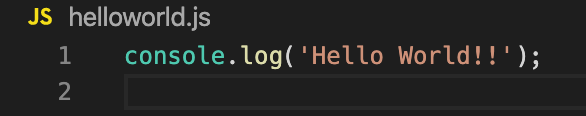

이렇게 작성한 뒤에 터미널을 열고 `node helloworld.js`를 입력합니다.

이 때, 파일의 위치에 터미널이 잘 위치해 있는지 잘 확인해야합니다.

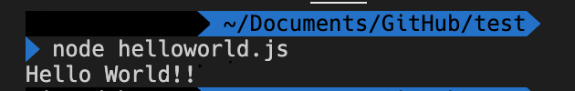

이렇게 했을 경우 실행이 잘 되는 것을 확인할 수 있습니다.

그럼 이제 단순히 JavaScript를 실행하는 것이 아니라, 다른 패키지들을 사용하는 방법을 빠르게 알아보겠습니다.

<br>

### Node Package Manager

Node.js는 npm이라는 것이 존재합니다. node package manager로 다른 사람들이 만든 것들을 다운받아 사용할 수 있습니다.

프레임워크를 사용하는 경우 npm에 모든 설정이 준비되어 거의 건드릴 필요가 없지만

모듈들을 사용하는 경우에는 초반 설정부터 해주어야 합니다.

일단 옵션들은 제외하고 모듈을 다운받기 위한 과정을 설명해드리겠습니다.

`npm init` 이라는 명령어를 실행하면 package manager의 기본 설정을 시작합니다.

패키지의 이름, 만든 사람부터 라이센스까지 모두 확인 및 설정하는 작업입니다.

이후에 다 설정할 수 있기 때문에 일단은 `npm init -y` 라는 명령어로 모두 yes라는 옵션을 주어 빠르게 설정합니다.

그럼 터미널에서 나오는 모습은 다음과 같을 것입니다.

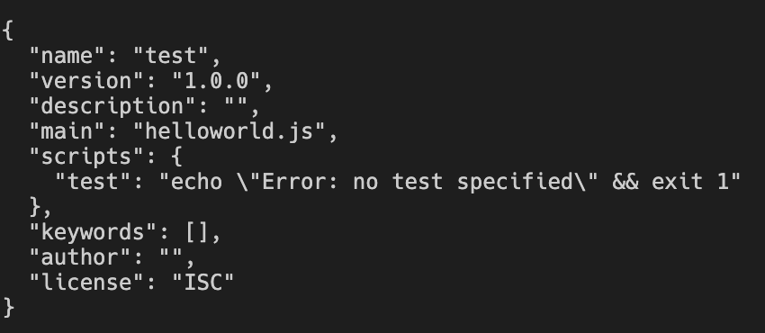

name은 폴더 이름이고, main은 만약 아무것도 없다면 index.js가 될 것입니다.

저는 아까 만든 helloworld.js파일이 있던 곳에서 바로 만들었기 때문에 helloworld.js가 main에 있습니다.

그럼 이제 해당 폴더에 `package.json` 파일이 만들어진 것을 볼 수 있습니다.

내용을 확인해보면 위와 완벽하게 동일합니다.

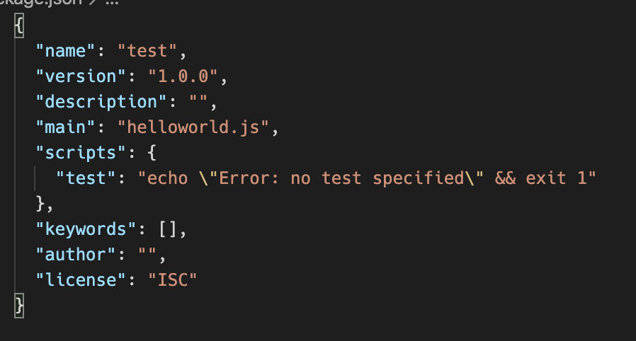

그럼 이제 npm으로 파일을 실행시키는 것부터 해보겠습니다.

scripts를 보면 test라는 키워드가 있습니다.

이를 지우고 `start` 라는 키워드를 붙인 뒤, `node`라는 내용을 넣어줍니다.

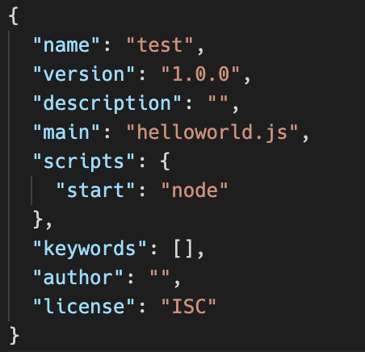

그런 다음 다시 터미널을 연 뒤에 `npm run start helloworld.js` 또는 `npm start helloworld.js`를 입력합니다.

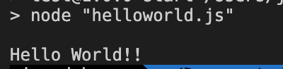

정상적으로 출력되는 것을 볼 수 있습니다. npm을 사용하여 실행하는 방법이며,

이는 이 후, 여러 가지 모듈들을 설치했을 때에 실행할 수 있는 방법입니다.

<br>

### TypeScript 설치 실습

예를 들어 TypeScript를 사용할 경우를 살펴보겠습니다.

TypeScript는 기본적으로 npm을 이용해서 설치합니다. 이 때 명령어는

`npm install -g typescript` 로 설치할 수 있습니다.

-g 옵션은 global, 그러니까 어디서든 사용할 수 있다는 뜻입니다.

하지만 프로젝트마다 TypeScript의 버전이 다를 수 있고, 굳이 전역으로 설치하지 않아도 되는 경우

굳이 -g을 사용하지 않고 `npm install typescript`를 사용하여 설치합니다.

TypeScript는 기본적으로 JavaScript로 다시 바꾸어 JavaScript를 실행하는 방식을 사용합니다.

따라서 바로 실행시킬 수 있는 ts-node라는 패키지를 사용해보겠습니다.

일단, 아래의 두 명령어를 실행합니다.

```zsh
$ npm install -D typescript
$ npm install -D ts-node
```

여기서 -D 옵션은 나중에 이를 배포하기 위해 빌드를 하는 데에 포함되지 않도록 하는 옵션입니다.

TypeScript를 JavaScript로 빌드한 뒤에 이를 배포할 때에 typescript와 ts-node 모듈은 필요 없겠죠?

설치가 완료되었다면 node_modules라는 폴더가 보일 것입니다. 이는 설치된 package에 대한 내용이기 때문에 볼 필요는 없습니다.

생략하고, `goodbye.ts`라는 파일을 만들어보겠습니다. 그리고 TypeScript에서 사용하는 문법을 사용한 코드를 실행해보겠습니다.

일단 코드를 작성합니다.

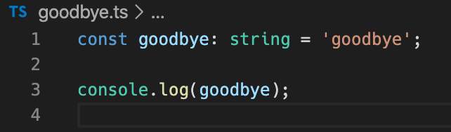

그리고 `node`와 `npm start`명령어로 실행되는 지 확인해봅시다.

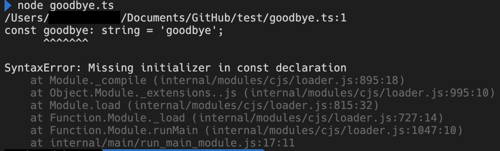

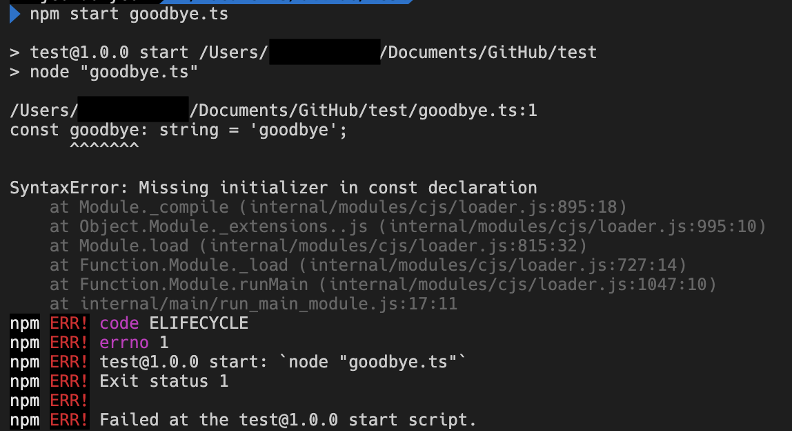

안되는 것을 확인할 수 있습니다. 그렇기 때문에 `ts-node`와 `tsc`리는 명령어를 활용해보겠습니다.

tsc는 typescript를 javascript로, ts-node는 typescript파일을 실행시켜주는 명령어입니다.

다음과 같이 package.json파일을 바꿉니다.

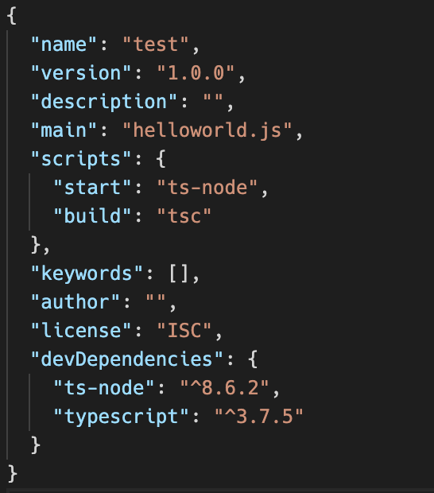

scripts의 `start`가 바뀌고 `build`라는 명령어가 추가되었습니다.

이후 터미널에 실행시켜봅시다. 일단 npm start 명령어를 실행합니다.

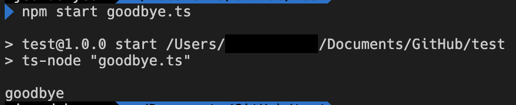

기존에 설치되었던 ts-node라는 패키지를 실행시키는 ts-node명령어를 사용하여

실행시킨 결과, 잘 실행되는 것을 확인할 수 있었습니다.

또한 새로 입력한 build에 들어간 `tsc`라는 명령어를 활용해봅시다.

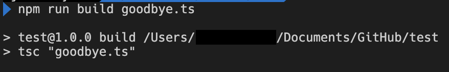

이 명령어를 실행한 뒤에 `goodbye.js`라는 파일이 새로 생긴 것을 확인할 수 있습니다.

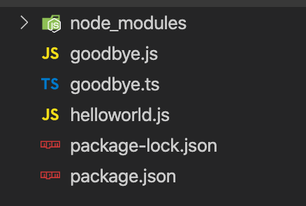

이 JavaScript파일을 다시 node로 실행시킬 수 있습니다.


<br></br>

## 정리하며

지금까지 Node.js가 무엇인지, 왜, 언제 써야하는지 그리고 기본적인 설치하는 법까지 확인해보았습니다.

이를 참고하여, 다른 프레임워크, 다른 패키지들을 활용하여

상상만 해왔던 본인만의 작품을 찬찬히 만들어 나갈 수 있을 것입니다.

<br>

참고:
https://thinkmobiles.com/blog/why-use-nodejs/
